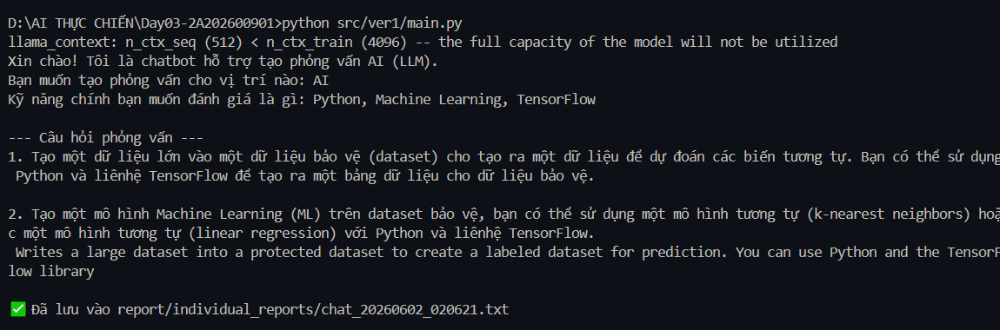
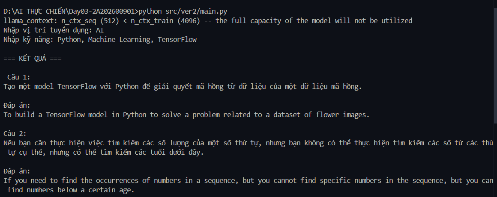

# AI Interview Assistant

## So sánh Chat LLM và ReAct Agent trong bài toán hỗ trợ phỏng vấn

### Thành viên thực hiện

* Tên: ...
* Môn học / Workshop: AI Thực Chiến
* Công nghệ: Python, llama-cpp-python, Phi-3 Mini GGUF

---

# 1. Giới thiệu đề tài

Trong quy trình tuyển dụng, nhà tuyển dụng thường phải xây dựng bộ câu hỏi phỏng vấn phù hợp với từng vị trí và kỹ năng chuyên môn. Công việc này mất nhiều thời gian và dễ thiếu tính nhất quán giữa các ứng viên.

Đề tài **AI Interview Assistant** được xây dựng nhằm hỗ trợ tự động sinh câu hỏi phỏng vấn dựa trên vị trí tuyển dụng và các kỹ năng cần đánh giá.

Mục tiêu của bài thực hành là so sánh hai cách tiếp cận:

* Chat LLM truyền thống
* ReAct Agent sử dụng Tool

---

# 2. Công nghệ sử dụng

| Thành phần           | Công nghệ              |
| -------------------- | ---------------------- |
| Programming Language | Python                 |
| Local LLM            | Phi-3 Mini 4K Instruct |
| Runtime              | llama-cpp-python       |
| Architecture 1       | Chat LLM               |
| Architecture 2       | ReAct Agent            |

---

# 3. Kiến trúc Chat LLM (Version 1)

## Luồng hoạt động

```text
User
 ↓
Prompt
 ↓
LLM
 ↓
Questions
```

Người dùng nhập:

```text
Role: AI Engineer
Skills: Python, Machine Learning, TensorFlow
```

Hệ thống tạo Prompt trực tiếp:

```python
prompt = f"""
Tạo 5 câu hỏi phỏng vấn cho vị trí {role}
Tập trung vào kỹ năng {skills}
"""
```

Sau đó gửi Prompt tới Phi-3 Mini và nhận kết quả.

---

## Ưu điểm

* Kiến trúc đơn giản.
* Ít thành phần.
* Dễ triển khai.
* Tốc độ phản hồi nhanh.
* Tiêu tốn ít tài nguyên.

## Nhược điểm

* Toàn bộ logic phụ thuộc Prompt.
* Không có khả năng sử dụng Tool.
* Khó mở rộng quy trình.
* Không lưu được các bước xử lý trung gian.
* Khó tích hợp hệ thống tuyển dụng thực tế.

---

# 4. Kiến trúc ReAct Agent (Version 2)

## Luồng hoạt động

```text
User
 ↓
Skill Analyzer
 ↓
Question Generator
 ↓
LLM
 ↓
Report Writer
 ↓
Result
```

Khác với Chat LLM, Agent không gọi LLM ngay mà thực hiện các bước xử lý thông qua Tool trước khi sinh kết quả cuối cùng.

---

# 5. Các Tool được sử dụng

## 5.1 Skill Analyzer

### Chức năng

* Phân tích kỹ năng đầu vào.
* Chuẩn hóa danh sách kỹ năng.
* Chuyển đổi dữ liệu để các Tool khác sử dụng.

### Ví dụ

Input:

```text
Python, Machine Learning, TensorFlow
```

Output:

```python
[
    "Python",
    "Machine Learning",
    "TensorFlow"
]
```

---

## 5.2 Question Generator

### Chức năng

* Xây dựng Prompt động.
* Tạo ngữ cảnh phỏng vấn.
* Điều chỉnh nội dung theo vị trí tuyển dụng.

Ví dụ:

```python
build_prompt(role, skills)
```

---

## 5.3 Report Writer

### Chức năng

* Lưu kết quả ra file.
* Hỗ trợ quản lý lịch sử phỏng vấn.
* Phục vụ tái sử dụng và đánh giá sau này.

Ví dụ:

```text
report/react_agent/
 └── report_20260602.txt
```

---

# 6. Ưu điểm và nhược điểm của ReAct Agent

## Ưu điểm

* Hỗ trợ sử dụng Tool.
* Workflow rõ ràng.
* Dễ mở rộng hệ thống.
* Dễ tích hợp Database.
* Dễ tích hợp ATS.
* Có thể tích hợp CV Parser.
* Có thể tích hợp Candidate Scoring.
* Có khả năng lưu báo cáo tự động.

## Nhược điểm

* Cấu trúc phức tạp hơn.
* Thời gian xử lý cao hơn Chat LLM.
* Cần xây dựng và bảo trì Tool.
* Tăng độ phức tạp khi mở rộng hệ thống.

---

# 7. Kết quả thực nghiệm

## Version 1 - Chat LLM

### Input

```text
Role: AI
Skills: Python, Machine Learning, TensorFlow
```

### Kết quả



### Nhận xét

* Sinh được câu hỏi phỏng vấn.
* Kết quả phụ thuộc nhiều vào Prompt.
* Chưa có đáp án mẫu.
* Một số nội dung còn chưa ổn định.

---

## Version 2 - ReAct Agent

### Input

```text
Role: AI
Skills: Python, Machine Learning, TensorFlow
```

### Kết quả



### Nhận xét

* Sinh được câu hỏi và đáp án mẫu.
* Có khả năng xử lý nhiều bước.
* Có thể mở rộng thêm các Tool khác.

---

# 8. So sánh tổng quan

| Tiêu chí           | Chat LLM | ReAct Agent |
| ------------------ | -------- | ----------- |
| Sinh câu hỏi       | ✓        | ✓           |
| Sinh đáp án mẫu    | ✗        | ✓           |
| Sử dụng Tool       | ✗        | ✓           |
| Lưu báo cáo        | ✗        | ✓           |
| Dễ triển khai      | ✓        | ✗           |
| Khả năng mở rộng   | ✗        | ✓           |
| Tích hợp ATS       | ✗        | ✓           |
| Tích hợp Database  | ✗        | ✓           |
| Tích hợp CV Parser | ✗        | ✓           |

---

# 9. Kết luận

Qua quá trình triển khai và thử nghiệm trên mô hình Phi-3 Mini chạy local bằng llama-cpp-python, có thể thấy:

* Chat LLM phù hợp với các tác vụ sinh nội dung đơn giản.
* ReAct Agent phù hợp với các hệ thống AI thực tế cần nhiều bước xử lý và khả năng mở rộng.
* Trong bài toán AI hỗ trợ phỏng vấn, ReAct Agent cho thấy tiềm năng phát triển thành trợ lý tuyển dụng thông minh nhờ khả năng kết hợp giữa LLM và các Tool chuyên biệt.

Trong tương lai, hệ thống có thể mở rộng thêm:

* CV Parser
* Candidate Scoring
* ATS Integration
* Database
* Web Search
* Feedback Generator
